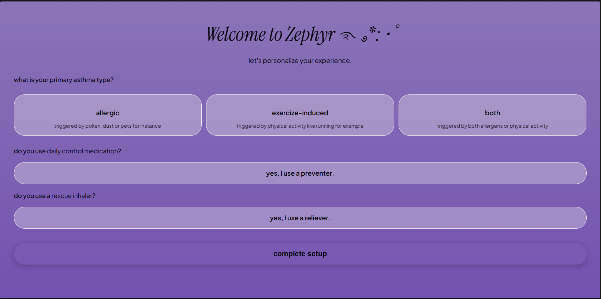
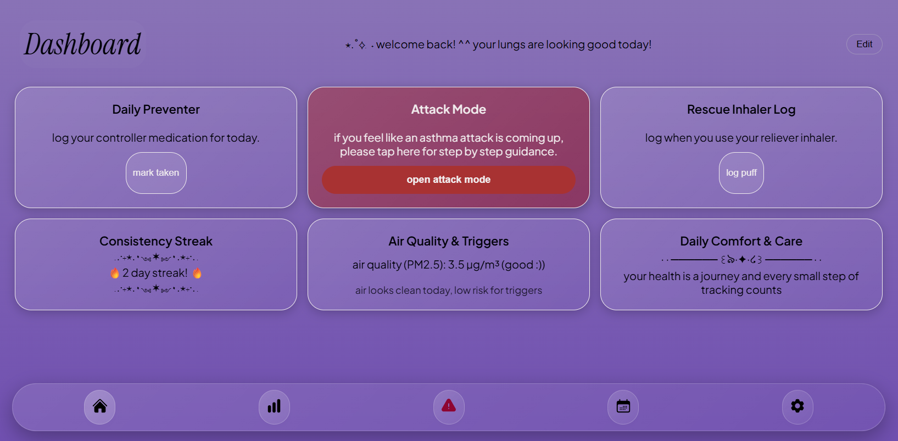
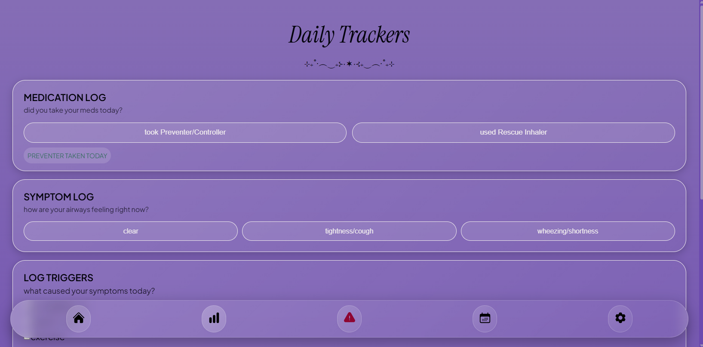
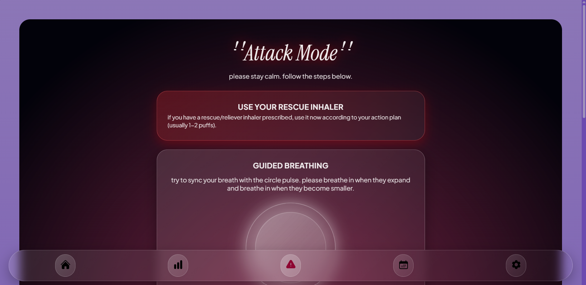
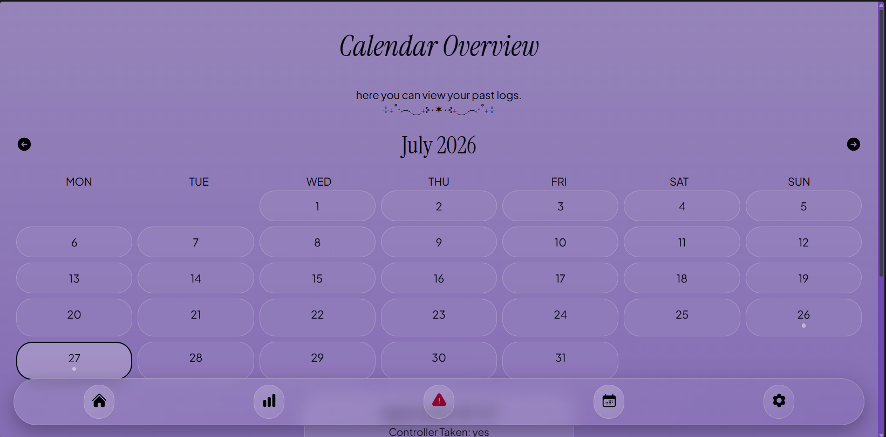
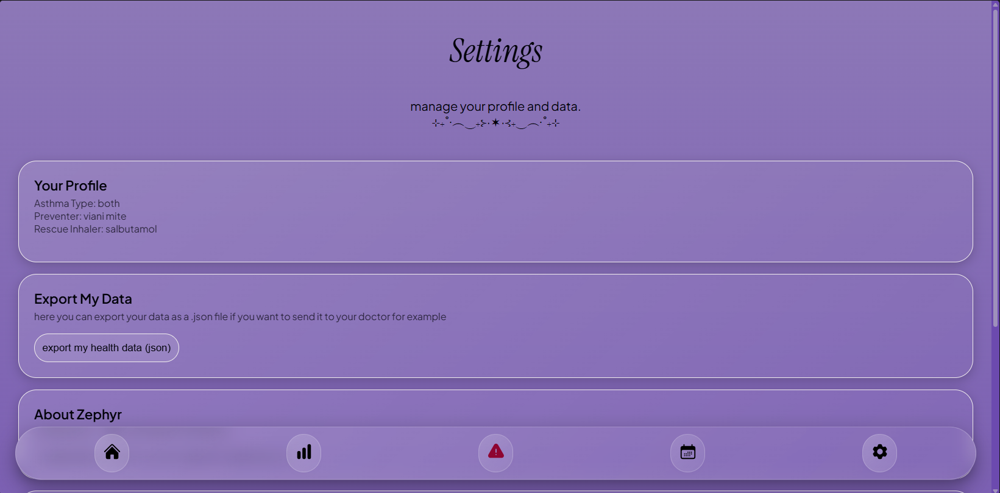

# zephyr - asthma-companion ⊹ ࣪ ˖
heyyy and welcome to my most recent project! this is ZEPHYR, the asthma companion web-app i'm building for horizons :)

 ݁ .‧₊⋆.٠༺✶༻٠.⋆₊‧. ݁

## ✧ about the project
as an asthmatic myself i know very well how hard managing asthma can get sometimes. esp remembering to use my preventer inhaler or also remembering what to do if i get an asthma attack. thats why i decided to build this web-app to help other fellow asthmatics with tracking their symptoms and medication usage as well as guiding them in case of an asthma attack. at the same time i tried to include the information i learned at my first-aid course recently lol. also, i not just wanted to build an app that feels solely like a tool, but much more one that feels welcoming and personal and has an at least somewhat aesthetic user interface :)

 ݁ .‧₊⋆.٠༺✶༻٠.⋆₊‧. ݁

## how the app works  𑣲⋆｡˚ ⟡˖ ࣪
when u open the app for the first, the onboarding screen appears where u can enter your asthma type and your medication use. 

then the app screen appears after u finish the setup. the app screen consists of 5 sub-screens/tabs:

1. dashboard -> here u can log ur inhalers quickly or view stuff like air quality or ur streak

2. trackers -> here u can log not only ur preventer & rescue inhaler, but also symptoms and symptom/attack triggers

3. attack mode -> when the user feels like they are about to have an asthma attack they can click on the attack mode to get a guide on what to do

4. calendar overview -> here u can view when u logged what 

5. settings -> here u can view ur profile data, export it or reset it to restart the onboarding process

 ݁ .‧₊⋆.٠༺✶༻٠.⋆₊‧. ݁

## special features im most proud of (hahaha) ₊˚⊹ ᢉ𐭩
* the guided breathing feature (attack mode screen)
* the breathing/moving background
* the glassy look esp the navbar
* the edit dashboard feature

 ݁ .‧₊⋆.٠༺✶༻٠.⋆₊‧. ݁

## 🛠 tech stack
* html5
* css3
* javascript
* github pages for hosting

 ݁ .‧₊⋆.٠༺✶༻٠.⋆₊‧. ݁

## problems that occured while coding ⋆｡˚𑣲⋆｡˚

* making the screens behave like i want was really, really hard at first
* in general, making everything look cute and aesthetic but clean and useful at the same time was also a lot harder than i thought
* plus working with the console
* the hardest part was probably the local storage and linking the logs to the calendar 

 ݁ .‧₊⋆.٠༺✶༻٠.⋆₊‧. ݁

## AI disclosure ⋆✴︎˚｡⋆
i mainly used ai to brainstorm some ideas or to fix bugs. sometimes i also used it when i didnt know where to start with a feature i have never done before.

 ݁ .‧₊⋆.٠༺✶༻٠.⋆₊‧. ݁

## ₊˚⊹ ࿔ how to visit
check out the live version here: **https://daliisalm22.github.io/asthma-companion/** 

 ݁ .‧₊⋆.٠༺✶༻٠.⋆₊‧. ݁

## video capture

  <video width="100%" controls autoplay loop muted>
    <source src="screenshots/video capture.mp4" type="video/mp4">
    Your browser does not support the video tag.
  </video>

## i hope u like the app ⋆𐙚₊˚⊹♡